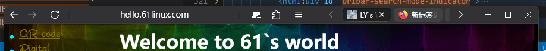
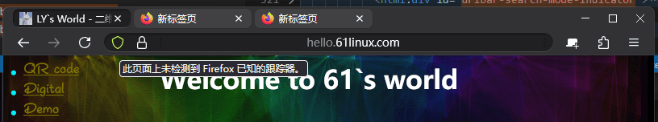

# firefox-theme

## ~~000-my~~

- linux 
- macos 

> 参照: `https://github.com/datguypiko/Firefox-Mod-Blur.git` 

## 001-topbar

- 单行 
- 双行 


# install

1. browser `about:config`
2. set `toolkit.legacyUserProfileCustomizations.stylesheets=true`
3. browser `about:support`, open **Profile Directory**
4. `cp ./* ${Profile Directory}/chrome/` and `cd ${Profile Directory}/chrome/`
5. run `./select 001`
6. restart firefox


# about firefox

## config left

see `https://support.mozilla.org/zh-CN/kb/%E7%AE%A1%E7%90%86%E7%94%A8%E6%88%B7%E9%85%8D%E7%BD%AE%E6%96%87%E4%BB%B6#w_start-the-profile-manager-when-firefox-is-closed`

run `firefox -P` to re init

# get window source code

## 源码(推荐)

### 关键文件

```bash
# 关键目录
./browser
# 关键文件 
## 顶部栏(url/tab...)
./browser/base/content/navigator-toolbox.inc.xhtml
## tab
./browser/compents/tabbrowser/content/tab.js
```

### 下载

**方法1**

1. https://hg-edge.mozilla.org/mozilla-central/
2. click "zip"

**方法2 hg**

```bash
# macOS (Homebrew)
brew install mercurial
# Ubuntu/Debian
sudo apt-get install mercurial

hg clone https://hg.mozilla.org/mozilla-central/
hg clone --pull https://hg.mozilla.org/mozilla-central/
```

**方法3 git**

`git clone https://github.com/mozilla/gecko-dev.git`


**方法4? 快照**

https://searchfox.org/mozilla-central/source/browser/components/urlbar/SearchModeSwitcher.sys.mjs

## ~~安装目录找~~

解压 `firefox安装目录/browser/omni.ja`

```bash
mkdir /tmp/firefox-window
unzip firefox安装目录/browser/omni.ja -d firefox-window
cd firefox-window

# 2个关键目录
cd chrome/browser/content/browser
cd chrome/browser/skin
# 2个关键文件
vim chrome/browser/content/browser/browser.xhtml
# tab 特殊
vim chrome/browser/content/browser/tqbbrowser/tab.js
```

## windows

```html
<div id="navigator-toolbox">
    <!-- tab bar -->
    <div id="titlebar">
        <div id="TabsToolbar">
            <div id="...">
                <div id="tabbrowser-tabs">
                    <div id="tabbrowser-arrowscrollbox">
                        <div class="tabbrowser-tab">
                            <div class="tab-stack">
                                icon 新标签页1
                                <div class="tab-background"></div>
                            </div>
                        </div>
                        <div class="tabbrowser-tab">
                            <div class="tab-stack">
                                icon 新标签页2
                                <div class="tab-background"></div>
                            </div>
                        </div>
                    </div>
                </div>
            </div>
        </div>
    </div>
    <!-- url bar -->
    <div id="nav-bar">
        <div id="nav-bar-customization-target">
            <div id="urlbar-container">
                <div id="urlbar">
                    <div id="urlbar-background"></div>
                    <div id="urlbar-input-container">
                        <div class="urlbar-input-box">
                            
                        </div>
                    </div>
                </div>
            </div>
        </div>
        <div id="PanelUI-button">
            <div id="PanelUI-menu-button">菜单(三横线)</div>
        </div>
    </div>
</div>
```

## macos/linux

```html
<div id="navigator-toolbox">
    <!-- tab bar -->
    <div id="TabsToolbar">
        <div id="...">
            <div id="tabbrowser-tabs">
                <div id="tabbrowser-arrowscrollbox">
                    <div class="tabbrowser-tab">
                        <div class="tab-stack">
                            icon 新标签页1
                            <div class="tab-background"></div>
                        </div>
                    </div>
                    <div class="tabbrowser-tab">
                        <div class="tab-stack">
                            icon 新标签页2
                            <div class="tab-background"></div>
                        </div>
                    </div>
                </div>
            </div>
        </div>
    </div>
    <!-- url bar -->
    <div id="nav-bar">
        <div id="nav-bar-customization-target">
            <div id="urlbar-container">
                <div id="urlbar">
                    <div id="urlbar-background"></div>
                    <div id="urlbar-input-container">
                        <div class="urlbar-input-box">
                            
                        </div>
                    </div>
                </div>
            </div>
        </div>
        <div id="PanelUI-button">
            <div id="PanelUI-menu-button">菜单(三横线)</div>
        </div>
    </div>
</div>
```

# source code build

1. 打开 https://firefox-source-docs.mozilla.org/contributing/directory_structure.html
2. 点击 “the repository”： https://firefox-source-docs.mozilla.org/contributing/contribution_quickref.html#firefox-contributors-quick-reference
3. Download the “MozillaBuild Package”: https://ftp.mozilla.org/pub/mozilla/libraries/win32/MozillaBuildSetup-Latest.exe
4. 打开exe程序