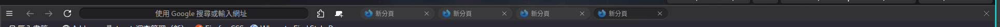
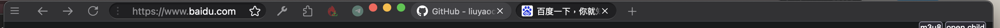
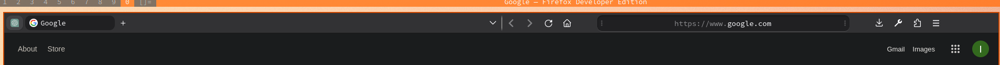

# firefox-theme

## 000 my theme

semi-finished: only top bar

**linux**



**macos**



## 001-Firefox-Mod-Blur-Modify

git from: `https://github.com/datguypiko/Firefox-Mod-Blur.git` 




# install

1. browser `about:config`
2. set `toolkit.legacyUserProfileCustomizations.stylesheets=true`
3. browser `about:support`, open **Profile Directory**
4. `cp ./* ${Profile Directory}/chrome/` and `cd ${Profile Directory}/chrome/`
5. run `./select 001`
6. restart firefox


# about firefox

## config left

see `https://support.mozilla.org/zh-CN/kb/%E7%AE%A1%E7%90%86%E7%94%A8%E6%88%B7%E9%85%8D%E7%BD%AE%E6%96%87%E4%BB%B6#w_start-the-profile-manager-when-firefox-is-closed`

run `firefox -P` to re init

# guess window source code

## linux

```html
<div id="navigator-toolbox">
    <!-- tab bar -->
    <div id="titlebar">
        <div id="TabsToolbar">
            <div id="...">
                <div id="tabbrowser-tabs">
                    <div id="tabbrowser-arrowscrollbox">
                        <div class="tabbrowser-tab">
                            <div class="tab-stack">
                                icon 新标签页1
                                <div class="tab-background"></div>
                            </div>
                        </div>
                        <div class="tabbrowser-tab">
                            <div class="tab-stack">
                                icon 新标签页2
                                <div class="tab-background"></div>
                            </div>
                        </div>
                    </div>
                </div>
            </div>
        </div>
    </div>
    <!-- url bar -->
    <div id="nav-bar">
        <div id="nav-bar-customization-target">
            <div id="urlbar-container">
                <div id="urlbar">
                    <div id="urlbar-background"></div>
                    <div id="urlbar-input-container">
                        <div class="urlbar-input-box">
                            
                        </div>
                    </div>
                </div>
            </div>
        </div>
        <div id="PanelUI-button">
            <div id="PanelUI-menu-button">菜单(三横线)</div>
        </div>
    </div>
</div>
```

## macos

```html
<div id="navigator-toolbox">
    <!-- tab bar -->
    <div id="TabsToolbar">
        <div id="...">
            <div id="tabbrowser-tabs">
                <div id="tabbrowser-arrowscrollbox">
                    <div class="tabbrowser-tab">
                        <div class="tab-stack">
                            icon 新标签页1
                            <div class="tab-background"></div>
                        </div>
                    </div>
                    <div class="tabbrowser-tab">
                        <div class="tab-stack">
                            icon 新标签页2
                            <div class="tab-background"></div>
                        </div>
                    </div>
                </div>
            </div>
        </div>
    </div>
    <!-- url bar -->
    <div id="nav-bar">
        <div id="nav-bar-customization-target">
            <div id="urlbar-container">
                <div id="urlbar">
                    <div id="urlbar-background"></div>
                    <div id="urlbar-input-container">
                        <div class="urlbar-input-box">
                            
                        </div>
                    </div>
                </div>
            </div>
        </div>
        <div id="PanelUI-button">
            <div id="PanelUI-menu-button">菜单(三横线)</div>
        </div>
    </div>
</div>
```


?? 
``` css
#urlbar[breakout][breakout-extend] > #urlbar-input-container,
.urlbar-page-action
#urlbar[breakout][breakout-extend][open]
#wrapper-urlbar-container
#urlbar-go-button
#urlbar .urlbarView-body-inner
#urlbar:not(.megabar):not([focused="true"]),
#urlbar:not(.megabar):not([focused="true"]):hover {
  border-bottom: transparent;
}
.urlbarView:not([noresults]) > .search-one-offs:not([hidden]) {
  border-top: none !important;
}
/* Megabar */
#urlbar[breakout] {
  height: auto !important;
}

```
